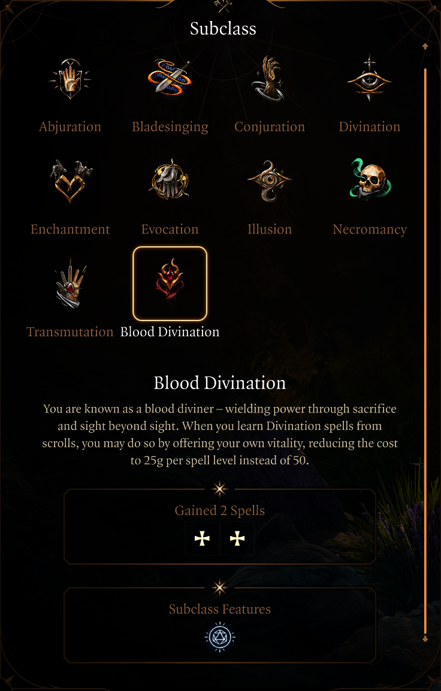
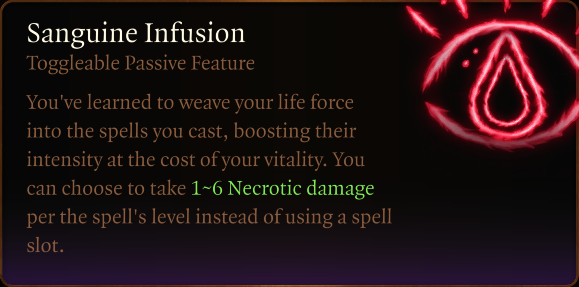
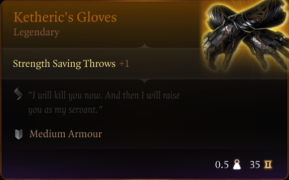
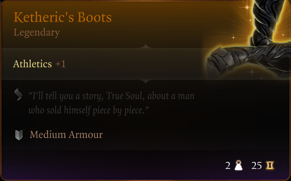

# General

These mods are available for use via the official Baldur's Gate 3 mod manager. The mods are provided as is. I do not promise to update them for future patches or fix them if any issues are discovered. If you find a bug, feel free to fork the repo, fix any possible issues yourself, and submit a pull request.

# Mods

- [Blood Divination](#blood-divination)
- [Ketheric's Gloves and Boots](#ketherics-gloves-and-boots)
- [Thieves' Toolkit](#thieves-toolkit)
- [Artisan's Vial Case](#artisans-vial-case)

## Blood Divination

The Blood Divination subclass is a homebrew spec I am playing on a tabletop DnD campaign. It is otherwise the same as the regular Diviner subclass, except that the level 6 subclass feature [Expert Divination](https://bg3.wiki/wiki/Expert_Divination) is replaced by a custom subclass feature called _Sanguine Infusion_.

In practice, Sanguine Infusion is a toggleable passive feature, similar to, e.g., Sorcerer's metamagic abilities. On each turn, before casting a spell, you can choose to click on the feature on your skill bar to power a spell using your health instead of a spell slot.

> **Sanguine Infusion**: _You've learned to weave your life force into the spells you cast, boosting their intensity at the cost of your vitality. You can choose to take 1d6 Necrotic damage per the spell's level instead of using a spell slot._

Credit for the subclass icon goes to [Dragonify03](https://next.nexusmods.com/profile/Dragonify03) and their [Icons for Modded Subclasses](https://www.nexusmods.com/baldursgate3/mods/4216) mod on Nexus Mods. The icon was originally created for a subclass called Arcanist (Exploiter) but I found it to be suitable for Blood Diviner as well.

## Ketheric's Gloves and Boots

This mod adds a set of gloves and boots with the appearance of those worn by Ketheric Thorm to the tutorial chest. The tutorial chest can be found natively on the nautiloid, and can later be summoned at will by using the [Tutorial Chest Summoning](https://www.nexusmods.com/baldursgate3/mods/457) mod. If you are also running other mods that add items to the tutorial chest, those may prevent the items from appearing. In such a case, you can either disable the conflicting mods, change the mod load order, or execute the following commands on the [BG3 Script Extender Debug Console](https://www.nexusmods.com/baldursgate3/articles/169) to spawn the items in the active character's inventory.

`TemplateAddTo("d870703c-e5fd-4f04-bd30-02b9552ee10e", GetHostCharacter(), 1)`

`TemplateAddTo("0d62ad3e-daea-4520-94d9-e85c8a388f26", GetHostCharacter(), 1)`

The items have basic stats to prevent them from being overpowered at the beginning of the game. You can transfer their appearance to items with better stats by using a transmogrification mod, such as [Transmog Enhanced](https://www.nexusmods.com/baldursgate3/mods/2922).

## Thieves' Toolkit

This mod adds a bag into the game that will automatically collect all of the thieves' tools and trap disarm toolkits that you loot. The bag is available from the tutorial chest. The tutorial chest can be found natively on the nautiloid, and can later be summoned at will by using the [Tutorial Chest Summoning](https://www.nexusmods.com/baldursgate3/mods/457) mod. The chest contains a single bag at a time. To get multiple bags, resummon the tutorial chest as many times as needed. If you are also running other mods that add items to the tutorial chest, those may prevent the bag from appearing. In such a case, you can either disable the conflicting mods, change the mod load order, or execute the following command on the [BG3 Script Extender Debug Console](https://www.nexusmods.com/baldursgate3/articles/169) to spawn the bag in the active character's inventory.

`TemplateAddTo("CONT_ThievesToolkit_8c73db8f-a233-4233-824e-2ace04ccdf99", GetHostCharacter(), 1)`

To uninstall, destroy all instances of the bag, and then save the game. After that, it is safe to disable and delete the mod. The game will crash if your save still contains the bag, but the mod is no longer installed and active. An easy way to destroy the bag is to put it back into the Tutorial Chest and wait for 5 turns for the chest to disappear from the game.

## Artisan's Vial Case

This mod adds a bag into the game that will automatically collect all dyes that you loot. The bag is available from the tutorial chest. The tutorial chest can be found natively on the nautiloid, and can later be summoned at will by using the [Tutorial Chest Summoning](https://www.nexusmods.com/baldursgate3/mods/457) mod. The chest contains a single bag at a time. To get multiple bags, resummon the tutorial chest as many times as needed. If you are also running other mods that add items to the tutorial chest, those may prevent the bag from appearing. In such a case, you can either disable the conflicting mods, change the mod load order, or execute the following command on the [BG3 Script Extender Debug Console](https://www.nexusmods.com/baldursgate3/articles/169) to spawn the bag in the active character's inventory.

`TemplateAddTo("CONT_VialCase_d8277afa-83fe-42e9-9e09-ec5ae256842e", GetHostCharacter(), 1)`

To uninstall, destroy all instances of the bag, and then save the game. After that, it is safe to disable and delete the mod. The game will crash if your save still contains the bag, but the mod is no longer installed and active. An easy way to destroy the bag is to put it back into the Tutorial Chest and wait for 5 turns for the chest to disappear from the game.

# Contributing

If you wish to edit the mods, you can use the Baldur's Gate 3 Toolkit to do so. If you have installed Baldur's Gate 3 via Steam, you can find the toolkit on your Steam library under Tools. YouTube has plenty of modding tutorials to get you started.

To effortlessly synchronize the local modding folders with your forked GitHub repository, I recommend you create symbolic links between the repo directories and the four local modding directories. You can do that by running the following commands (after updating them with your local paths) from the command line with admin privileges. You need to do this individually for each mod you wish to edit.

`mklink /d "C:\Program Files (x86)\Steam\steamapps\common\Baldurs Gate 3\Data\Editor\Mods\KethericsGloves_8517830f-a9e1-be14-de59-b3ef4302015c" "C:\_github\LauraKokkarinen\BG3.Mods\Editor\Mods\KethericsGloves_8517830f-a9e1-be14-de59-b3ef4302015c"`

`mklink /d "C:\Program Files (x86)\Steam\steamapps\common\Baldurs Gate 3\Data\Mods\KethericsGloves_8517830f-a9e1-be14-de59-b3ef4302015c" "C:\_github\LauraKokkarinen\BG3.Mods\Mods\KethericsGloves_8517830f-a9e1-be14-de59-b3ef4302015c"`

`mklink /d "C:\Program Files (x86)\Steam\steamapps\common\Baldurs Gate 3\Data\Projects\KethericsGloves_8517830f-a9e1-be14-de59-b3ef4302015c" "C:\_github\LauraKokkarinen\BG3.Mods\Projects\KethericsGloves_8517830f-a9e1-be14-de59-b3ef4302015c"`

`mklink /d "C:\Program Files (x86)\Steam\steamapps\common\Baldurs Gate 3\Data\Public\KethericsGloves_8517830f-a9e1-be14-de59-b3ef4302015c" "C:\_github\LauraKokkarinen\BG3.Mods\Public\KethericsGloves_8517830f-a9e1-be14-de59-b3ef4302015c"`
